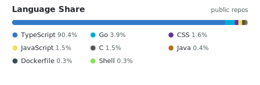

## 안녕하세요, sinwoojin입니다 👋

**React / Next.js / TypeScript 중심의 프론트엔드 개발자**입니다.

사용자가 실제로 만지는 화면을 안정적으로 만들고, API 연동·상태 관리·컴포넌트 구조·개발 경험을 개선하는 데 관심이 많습니다.

---

### 🛠️ Tech Stack

  
  
  
  
  

- **Frontend**: React, Next.js, TypeScript, JavaScript, HTML, CSS
- **Styling**: CSS Modules, Sass, Styled Components
- **Tools**: Git, Vite, npm
- **Learning / Side Projects**: Go, Shell Script

---

### 🚀 Recent Focus

- React / Next.js 기반 UI 구현과 컴포넌트 구조 개선
- TypeScript를 활용한 안전한 API 연동과 상태 관리
- 작은 사이드 프로젝트를 통해 배운 내용을 실제 코드로 정리

---

### 📊 Language Share

---

<!-- AUTO-STATS:START -->
_Last updated: 2026-07-03 02:01 KST · public repos: 7 · total stars: 0_

### 🧭 Recently Updated Public Repos

- [sinwoojin](https://github.com/sinwoojin/sinwoojin) · Mixed · ⭐ 0 — No description yet
- [sitewatch](https://github.com/sinwoojin/sitewatch) · Go · ⭐ 0 — No description yet
- [woojin](https://github.com/sinwoojin/woojin) · TypeScript · ⭐ 0 — No description yet
- [react-hydration-safe](https://github.com/sinwoojin/react-hydration-safe) · TypeScript · ⭐ 0 — No description yet
- [btc-price](https://github.com/sinwoojin/btc-price) · TypeScript · ⭐ 0 — No description yet
<!-- AUTO-STATS:END -->

---

### 📫 Contact

- **Email**: slow3993@gmail.com
- **GitHub**: [@sinwoojin](https://github.com/sinwoojin)

---

### Contributors

- https://github.com/gosuda/portal/pull/105
- https://github.com/gosuda/portal/pull/39
